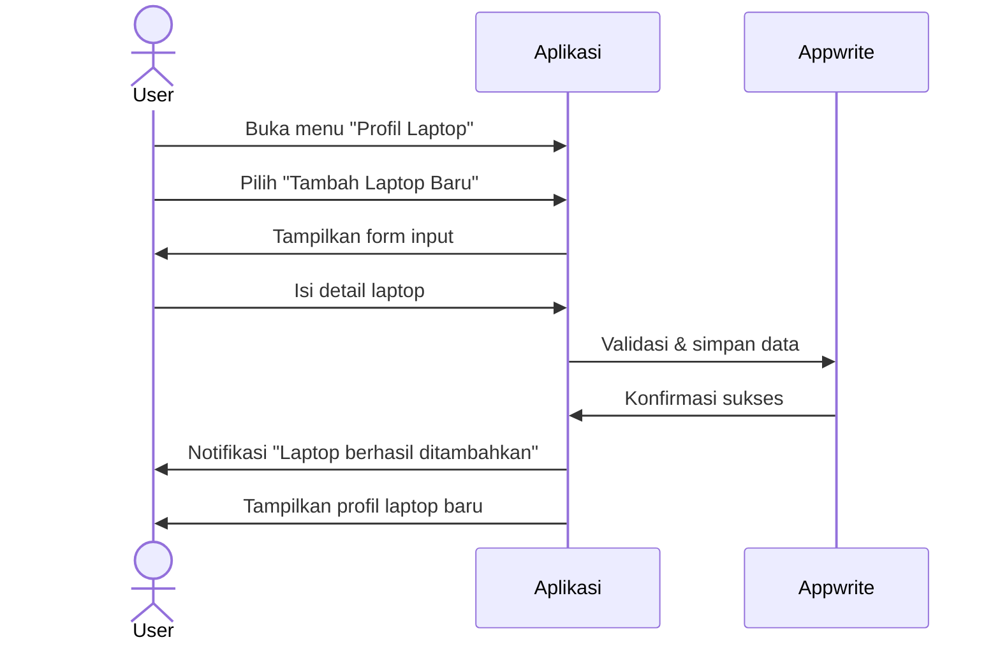
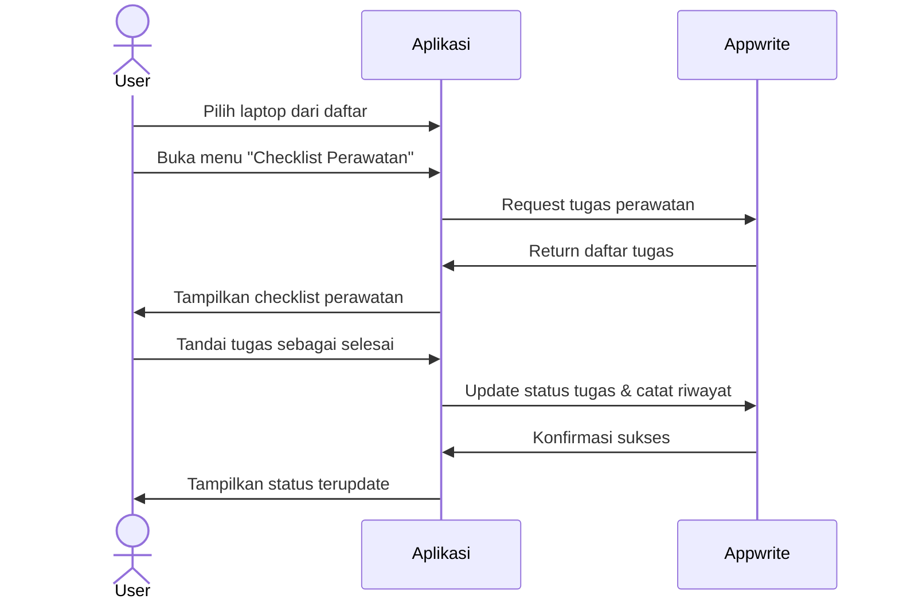

# **Spesifikasi Kebutuhan Perangkat Lunak (SKPL)**  
## **Aplikasi Pengingat & Checklist Perawatan Laptop 'LaptopCare' (MVP)**  

**Versi:** 0.1  
**Tanggal:** 28 Mei 2024  
**Penyusun:** [Nama Anda]  

---

## **Daftar Isi**  
1. [Pendahuluan](#1-pendahuluan)  
2. [Deskripsi Umum](#2-deskripsi-umum)  
3. [Kebutuhan Spesifik](#3-kebutuhan-spesifik)  
4. [Alur Pengguna](#4-alur-pengguna)  
5. [Implementasi](#5-implementasi)  

---

## **1. Pendahuluan**  

### **1.1 Tujuan**  
Aplikasi LaptopCare adalah solusi manajemen perawatan laptop. Tujuan utama:  
- Membantu pengguna laptop melakukan perawatan rutin secara teratur.  
- Memperpanjang umur pakai laptop melalui sistem checklist perawatan.  
- Mencegah masalah umum dengan pengingat perawatan berkala.  
- Memberikan panduan perawatan yang mudah diikuti oleh pengguna awam.  

### **1.2 Lingkup Produk**  
Fitur inti MVP:  
- Registrasi dan login pengguna.  
- Pembuatan profil laptop dengan spesifikasi dasar.  
- Checklist perawatan rutin dengan kategori (fisik, software, keamanan, performa).  
- Pengingat jadwal perawatan berkala (harian, mingguan, bulanan, kuartalan).  
- Panduan dasar troubleshooting dan perawatan.  
- Riwayat perawatan sederhana.  

### **1.3 Target Pengguna**  
- **Pengguna Umum:** Pemilik laptop dari berbagai latar belakang.  
- **Profesional:** Pengguna yang bergantung pada laptop untuk pekerjaan.  
- **Mahasiswa:** Pengguna yang membutuhkan laptop untuk studi.  
- **Pengguna Awam:** Membutuhkan panduan sederhana untuk perawatan laptop.  

---

## **2. Deskripsi Umum**  

### **2.1 Perspektif Produk**  
- Aplikasi mobile (Android/iOS) dengan Flutter.  
- Arsitektur:  
  - Frontend: Flutter (cross-platform).  
  - Backend: Appwrite (BaaS - Backend as a Service).  
  - Integrasi: Notifikasi lokal, ekspor data, mode offline.  

### **2.2 Fitur Utama (MVP)**  
1. **Autentikasi**  
   - Registrasi/login dengan email dan password menggunakan Appwrite Auth.  
   - Profil pengguna sederhana.  

2. **Manajemen Profil Laptop**  
   - Tambah/edit/hapus profil laptop.  
   - Input spesifikasi dasar (merek, model, OS, RAM, penyimpanan, CPU).  
   - Upload foto laptop (opsional) ke Appwrite Storage.  

3. **Checklist Perawatan**  
   - Tugas perawatan berdasarkan kategori.  
   - Tandai tugas sebagai selesai.  
   - Checklist khusus berdasarkan jenis laptop.  

4. **Pengingat Perawatan**  
   - Jadwalkan pengingat berkala.  
   - Notifikasi untuk tugas yang tertunda.  
   - Pengaturan frekuensi pengingat.  

5. **Panduan Perawatan**  
   - Panduan teks dan gambar.  
   - Kategorisasi panduan berdasarkan jenis perawatan.  
   - Tips troubleshooting umum.  

6. **Riwayat Perawatan**  
   - Pencatatan aktivitas perawatan.  
   - Filter riwayat berdasarkan kategori/waktu.  
   - Statistik perawatan sederhana.  

### **2.3 Karakteristik Pengguna**  
- Pengguna Umum: Membutuhkan antarmuka intuitif dan panduan sederhana.  
- Pengguna Teknis: Menginginkan detail dan opsi kustomisasi.  
- Pengguna Bisnis: Fokus pada efisiensi dan manajemen multiple laptop.  

---

## **3. Kebutuhan Spesifik**  

### **3.1 Kebutuhan Fungsional**  

#### **3.1.1 Manajemen Pengguna**  
- **F-USR-001: Registrasi Pengguna**  
  - Input: Email, password, nama (opsional).  
  - Proses: Validasi email, cek keunikan, enkripsi password melalui Appwrite Auth.  
  - Output: Akun dibuat dan pengguna dapat login.  

- **F-USR-002: Login Pengguna**  
  - Input: Email, password.  
  - Proses: Verifikasi kredensial melalui Appwrite Auth.  
  - Output: Login berhasil, data pengguna dimuat.  

#### **3.1.2 Manajemen Laptop**  
- **F-LPT-001: Pembuatan Profil Laptop**  
  - Input: Nama laptop, merek, model, tanggal pembelian, OS, spesifikasi dasar.  
  - Proses: Validasi, simpan ke Appwrite Database.  
  - Output: Profil laptop muncul di daftar laptop pengguna.  

- **F-LPT-002: Mengedit Profil Laptop**  
  - Input: Form profil laptop dengan data yang sudah terisi.  
  - Proses: Validasi dan update data di Appwrite Database.  
  - Output: Detail laptop ter-update.  

#### **3.1.3 Checklist Perawatan**  
- **F-CHK-001: Melihat Checklist Perawatan**  
  - Input: Profil laptop yang dipilih, kategori perawatan (opsional).  
  - Proses: Generate checklist berdasarkan profil laptop dan kategori dari Appwrite Database.  
  - Output: Daftar tugas perawatan yang direkomendasikan.  

- **F-CHK-002: Menandai Tugas Perawatan**  
  - Input: Tugas perawatan yang dipilih.  
  - Proses: Update status tugas, catat waktu penyelesaian di Appwrite Database.  
  - Output: Status tugas ter-update, ditambahkan ke riwayat.  

#### **3.1.4 Pengingat & Panduan**  
- **F-RMD-001: Mengatur Pengingat**  
  - Input: Tugas perawatan, frekuensi (harian, mingguan, bulanan, kuartalan).  
  - Proses: Jadwalkan pengingat berdasarkan frekuensi di Appwrite Functions.  
  - Output: Pengingat tersimpan dan akan muncul sesuai jadwal.  

- **F-GDE-001: Melihat Panduan**  
  - Input: Kategori panduan, tugas spesifik (opsional).  
  - Proses: Ambil panduan dari Appwrite Database.  
  - Output: Tampilkan panduan dengan teks dan gambar dari Appwrite Storage.  

#### **3.1.5 Fitur Premium**  
- **F-PRE-001: Mode Offline**  
  - Proses: Simpan data yang diperlukan secara lokal dengan caching Appwrite.  
  - Output: Aplikasi dapat digunakan tanpa koneksi internet.  

- **F-PRE-002: Ekspor Data**  
  - Input: Profil laptop, jenis data (checklist, riwayat), format (PDF/CSV).  
  - Proses: Generate file ekspor melalui Appwrite Functions.  
  - Output: File tersedia untuk diunduh.  

### **3.2 Model Data**  

#### **Koleksi `users` (Appwrite)**  
```json
{
  "user_id": "unique()",
  "email": "string",
  "name": "string",
  "created_at": "datetime",
  "last_login": "datetime",
  "theme": "string",
  "notifications_enabled": "boolean"
}
```

#### **Koleksi `laptops`**  
```json
{
  "laptop_id": "unique()",
  "user_id": "string",
  "name": "string",
  "brand": "string",
  "model": "string",
  "purchase_date": "datetime",
  "os": "string",
  "ram": "string",
  "storage": "string",
  "cpu": "string",
  "gpu": "string",
  "image_id": "string",
  "created_at": "datetime",
  "updated_at": "datetime"
}
```

#### **Koleksi `maintenance_tasks`**  
```json
{
  "task_id": "unique()",
  "user_id": "string",
  "laptop_id": "string",
  "category": "enum('physical', 'software', 'security', 'performance')",
  "title": "string",
  "description": "string",
  "frequency": "enum('daily', 'weekly', 'monthly', 'quarterly')",
  "priority": "enum('low', 'medium', 'high')",
  "created_at": "datetime",
  "updated_at": "datetime"
}
```

#### **Koleksi `maintenance_history`**  
```json
{
  "history_id": "unique()",
  "user_id": "string",
  "laptop_id": "string",
  "task_id": "string",
  "completion_date": "datetime",
  "notes": "string",
  "created_at": "datetime"
}
```

#### **Koleksi `reminders`**  
```json
{
  "reminder_id": "unique()",
  "user_id": "string",
  "laptop_id": "string",
  "task_id": "string",
  "scheduled_date": "datetime",
  "frequency": "enum('daily', 'weekly', 'monthly', 'quarterly')",
  "status": "enum('pending', 'sent', 'completed')",
  "created_at": "datetime",
  "updated_at": "datetime"
}
```

#### **Koleksi `guides`**  
```json
{
  "guide_id": "unique()",
  "category": "enum('physical', 'software', 'security', 'performance')",
  "title": "string",
  "content": "string",
  "difficulty": "enum('easy', 'medium', 'advanced')",
  "estimated_time": "integer",
  "is_premium": "boolean",
  "created_at": "datetime",
  "updated_at": "datetime"
}
```

#### **Koleksi `guide_images`**  
```json
{
  "image_id": "unique()",
  "guide_id": "string",
  "storage_id": "string",
  "display_order": "integer",
  "created_at": "datetime"
}
```

---

## **4. Alur Pengguna**  

### **4.1 Alur Pembuatan Profil Laptop**  


### **4.2 Alur Checklist Perawatan**  


---

## **5. Implementasi**  

### **5.1 Rencana Pengembangan (4 Minggu)**  
- **Minggu 1:** Setup Flutter + Appwrite, desain UI/UX.  
- **Minggu 2:** Implementasi autentikasi dan manajemen profil laptop.  
- **Minggu 3:** Implementasi checklist perawatan dan pengingat.  
- **Minggu 4:** Implementasi panduan, riwayat perawatan, testing, dan deployment.  

### **5.2 Tech Stack**  
- **Frontend:** Flutter (Dart) untuk mobile.  
- **Backend:** Appwrite (BaaS) untuk database, autentikasi, dan storage.  
- **Layanan Eksternal:**  
  - Flutter Local Notifications untuk notifikasi.  
  - Appwrite Functions untuk logika backend.
  - Appwrite Storage untuk penyimpanan gambar dan file.
  - Appwrite Realtime untuk sinkronisasi data.

### **5.3 Strategi Monetisasi**  
- **Model Freemium:**
  - Versi Gratis: Manajemen satu profil laptop, checklist dasar, pengingat sederhana.
  - Versi Premium: Multiple laptop profiles, panduan detail, analisis lanjutan.
- **Strategi Konversi:**
  - Trial premium 14 hari
  - Promosi in-app
  - Diskon untuk langganan tahunan
  - Program referral

--- 

**Catatan:** Aplikasi ini dapat dikembangkan lebih lanjut dengan menambahkan fitur seperti integrasi dengan sistem monitoring hardware, diagnosa masalah otomatis, atau komunitas tips perawatan sesuai kebutuhan pengguna. 