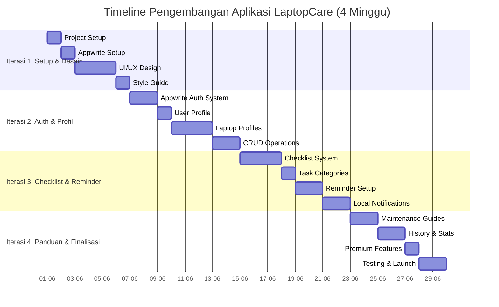
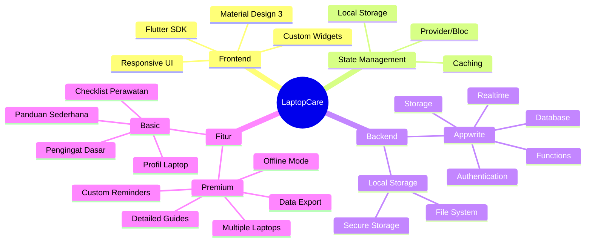
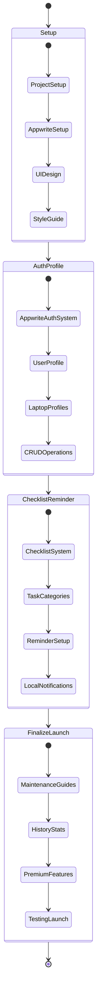
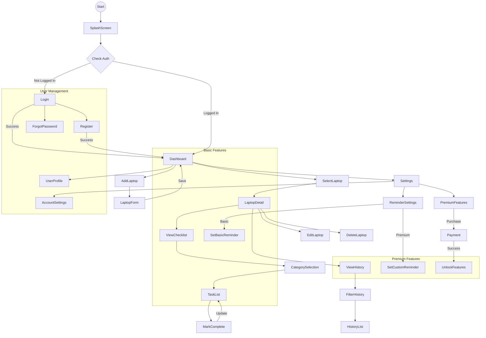
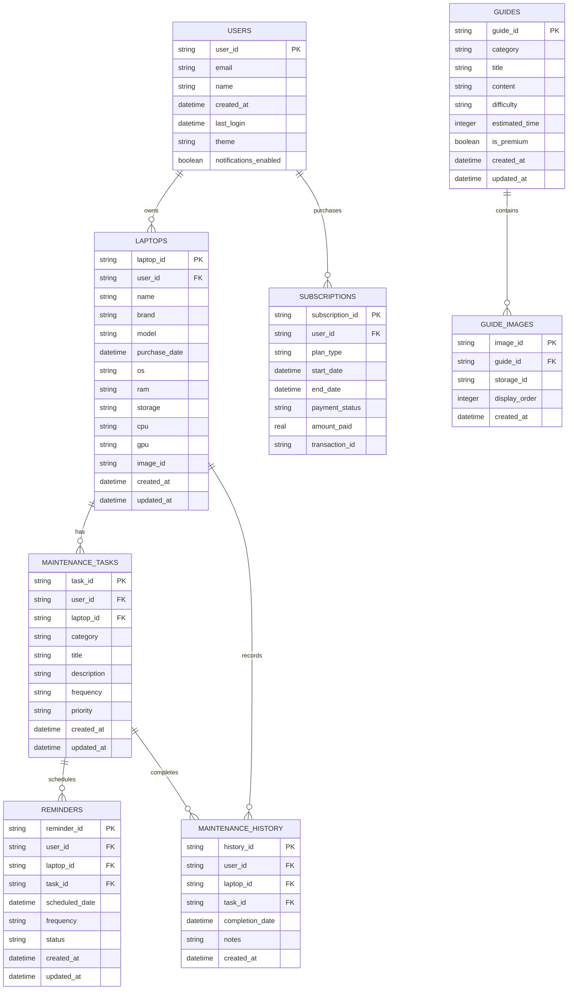
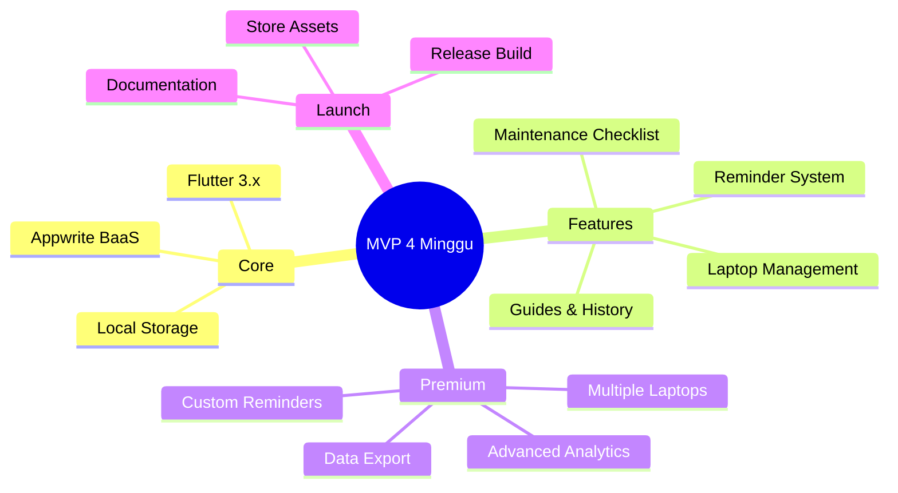

# **Timeline Iterasi Pengembangan Aplikasi LaptopCare**

## **1. Gantt Chart Timeline**



## **2. Mindmap Fitur & Teknologi**



## **3. Alur Pengembangan**



## **4. User Flow Diagram**



## **5. Database Schema (Appwrite)**



## **Appwrite Implementation**

```dart
// Appwrite Helper Class
class AppwriteService {
  static final AppwriteService _instance = AppwriteService._internal();
  
  // Appwrite SDK clients
  late Client client;
  late Account account;
  late Databases databases;
  late Storage storage;
  late Realtime realtime;
  
  // Appwrite project constants
  static const String endpoint = 'https://cloud.appwrite.io/v1';
  static const String projectId = 'laptopcare';
  static const String databaseId = 'laptopcare-db';
  static const String usersCollectionId = 'users';
  static const String laptopsCollectionId = 'laptops';
  static const String tasksCollectionId = 'maintenance_tasks';
  static const String historyCollectionId = 'maintenance_history';
  static const String remindersCollectionId = 'reminders';
  static const String guidesCollectionId = 'guides';
  static const String guideImagesCollectionId = 'guide_images';
  static const String storageId = 'laptopcare-storage';

  factory AppwriteService() => _instance;

  AppwriteService._internal() {
    // Initialize Appwrite clients
    client = Client()
      .setEndpoint(endpoint)
      .setProject(projectId)
      .setSelfSigned(status: true); // For development only
    
    account = Account(client);
    databases = Databases(client);
    storage = Storage(client);
    realtime = Realtime(client);
  }

  // Authentication methods
  Future<User> createAccount({required String email, required String password, String? name}) async {
    try {
      final user = await account.create(
        userId: ID.unique(),
        email: email,
        password: password,
        name: name,
      );
      
      // Create user profile in database
      await databases.createDocument(
        databaseId: databaseId,
        collectionId: usersCollectionId,
        documentId: user.$id,
        data: {
          'email': email,
          'name': name ?? '',
          'created_at': DateTime.now().toIso8601String(),
          'theme': 'light',
          'notifications_enabled': true,
        },
      );
      
      return user;
    } catch (e) {
      rethrow;
    }
  }

  Future<Session> login({required String email, required String password}) async {
    try {
      return await account.createEmailSession(
        email: email,
        password: password,
      );
    } catch (e) {
      rethrow;
    }
  }
  
  // CRUD operations for laptops
  Future<Document> createLaptop({
    required String userId,
    required String name,
    String? brand,
    String? model,
    DateTime? purchaseDate,
    String? os,
    String? ram,
    String? storage,
    String? cpu,
    String? gpu,
    String? imageId,
  }) async {
    try {
      return await databases.createDocument(
        databaseId: databaseId,
        collectionId: laptopsCollectionId,
        documentId: ID.unique(),
        data: {
          'user_id': userId,
          'name': name,
          'brand': brand ?? '',
          'model': model ?? '',
          'purchase_date': purchaseDate?.toIso8601String() ?? '',
          'os': os ?? '',
          'ram': ram ?? '',
          'storage': storage ?? '',
          'cpu': cpu ?? '',
          'gpu': gpu ?? '',
          'image_id': imageId ?? '',
          'created_at': DateTime.now().toIso8601String(),
          'updated_at': DateTime.now().toIso8601String(),
        },
      );
    } catch (e) {
      rethrow;
    }
  }
  
  // Other methods for maintenance tasks, reminders, etc.
  // ...
}
```

## **Ringkasan Progress per Iterasi**

| Iterasi | Status | Deliverables | Persentase Kesuksesan |
|---------|--------|--------------|-----------------|
| Setup & Desain | 🟠 In Progress | Project Setup, Appwrite Setup, UI/UX Design, Style Guide | 50% (2/4 tasks) |
| Auth & Profil | 🟡 Planning | Appwrite Auth System, User Profile, Laptop Profiles, CRUD | 0% |
| Checklist & Reminder | 🟡 Planning | Checklist System, Task Categories, Reminder Setup, Local Notifications | 0% |
| Panduan & Finalisasi | 🟡 Planning | Maintenance Guides, History & Stats, Premium Features, Testing & Launch | 0% |

### Iterasi 1: Setup & Desain (1 minggu)
- **Project Foundation** ✅
  - Flutter project initialization ✅
  - Appwrite project setup & configuration ✅
  - Git repository setup ✅
  - Basic project structure ✅
- **UI/UX Design** 🔄
  - Wireframing halaman utama
  - Desain sistem navigasi
  - Pembuatan style guide (warna, font, komponen)
  - Implementasi tema aplikasi (light/dark mode)

### Iterasi 2: Auth & Profil (1 minggu)
- **Appwrite Auth System**
  - Implementasi halaman login
  - Implementasi halaman registrasi
  - Implementasi authentication dengan Appwrite Auth
  - Manajemen state autentikasi
- **Laptop Profiles**
  - Implementasi halaman daftar laptop
  - Form tambah/edit profil laptop
  - Integrasi dengan Appwrite Database untuk CRUD laptop
  - Upload dan manajemen foto laptop ke Appwrite Storage

### Iterasi 3: Checklist & Reminder (1 minggu)
- **Checklist System**
  - Implementasi halaman kategori perawatan
  - Implementasi daftar tugas perawatan
  - Fungsi tandai selesai dan tracking riwayat
  - Filter dan pencarian tugas
- **Reminder System**
  - Implementasi pengaturan pengingat
  - Integrasi Flutter Local Notifications
  - Manajemen jadwal pengingat dengan Appwrite Functions
  - Notifikasi lokal

### Iterasi 4: Panduan & Finalisasi (1 minggu)
- **Maintenance Guides**
  - Implementasi halaman panduan
  - Integrasi konten panduan dari Appwrite Database
  - Rendering konten rich-text/markdown
  - Implementasi gambar panduan dari Appwrite Storage
- **History & Stats**
  - Implementasi halaman riwayat perawatan
  - Filter dan visualisasi data riwayat
  - Implementasi statistik dasar
  - Ekspor data (fitur premium) dengan Appwrite Functions
- **Launch Prep**
  - Unit & integration testing
  - UI testing
  - Performance optimization
  - Build release version
  - Deployment ke Play Store/App Store

## **Appwrite Integration**

```dart
// Appwrite Helper Class
class AppwriteService {
  static final AppwriteService _instance = AppwriteService._internal();
  
  // Appwrite SDK clients
  late Client client;
  late Account account;
  late Databases databases;
  late Storage storage;
  late Realtime realtime;
  
  // Appwrite project constants
  static const String endpoint = 'https://cloud.appwrite.io/v1';
  static const String projectId = 'laptopcare';
  static const String databaseId = 'laptopcare-db';
  static const String usersCollectionId = 'users';
  static const String laptopsCollectionId = 'laptops';
  static const String tasksCollectionId = 'maintenance_tasks';
  static const String historyCollectionId = 'maintenance_history';
  static const String remindersCollectionId = 'reminders';
  static const String guidesCollectionId = 'guides';
  static const String guideImagesCollectionId = 'guide_images';
  static const String storageId = 'laptopcare-storage';

  factory AppwriteService() => _instance;

  AppwriteService._internal() {
    // Initialize Appwrite clients
    client = Client()
      .setEndpoint(endpoint)
      .setProject(projectId)
      .setSelfSigned(status: true); // For development only
    
    account = Account(client);
    databases = Databases(client);
    storage = Storage(client);
    realtime = Realtime(client);
  }

  // Authentication methods
  Future<User> createAccount({required String email, required String password, String? name}) async {
    try {
      final user = await account.create(
        userId: ID.unique(),
        email: email,
        password: password,
        name: name,
      );
      
      // Create user profile in database
      await databases.createDocument(
        databaseId: databaseId,
        collectionId: usersCollectionId,
        documentId: user.$id,
        data: {
          'email': email,
          'name': name ?? '',
          'created_at': DateTime.now().toIso8601String(),
          'theme': 'light',
          'notifications_enabled': true,
        },
      );
      
      return user;
    } catch (e) {
      rethrow;
    }
  }

  Future<Session> login({required String email, required String password}) async {
    try {
      return await account.createEmailSession(
        email: email,
        password: password,
      );
    } catch (e) {
      rethrow;
    }
  }
  
  // CRUD operations for laptops
  Future<Document> createLaptop({
    required String userId,
    required String name,
    String? brand,
    String? model,
    DateTime? purchaseDate,
    String? os,
    String? ram,
    String? storage,
    String? cpu,
    String? gpu,
    String? imageId,
  }) async {
    try {
      return await databases.createDocument(
        databaseId: databaseId,
        collectionId: laptopsCollectionId,
        documentId: ID.unique(),
        data: {
          'user_id': userId,
          'name': name,
          'brand': brand ?? '',
          'model': model ?? '',
          'purchase_date': purchaseDate?.toIso8601String() ?? '',
          'os': os ?? '',
          'ram': ram ?? '',
          'storage': storage ?? '',
          'cpu': cpu ?? '',
          'gpu': gpu ?? '',
          'image_id': imageId ?? '',
          'created_at': DateTime.now().toIso8601String(),
          'updated_at': DateTime.now().toIso8601String(),
        },
      );
    } catch (e) {
      rethrow;
    }
  }
  
  // Other methods for maintenance tasks, reminders, etc.
  // ...
}
```

## **Tech Stack Detail**



## **Catatan Implementasi**
- Fokus pada user experience yang intuitif dan sederhana
- Optimasi performa dan penggunaan baterai untuk sistem pengingat
- Prioritaskan fitur MVP sebelum fitur premium
- Implementasi caching untuk mode offline dasar dengan Appwrite
- Desain responsif untuk berbagai ukuran layar
- Dokumentasi lengkap untuk maintenance jangka panjang

---

## **Rencana Pengembangan (4 Minggu)**

---

## **Minggu 1: Setup & Desain Dasar** (50% Selesai)

### **Hari 1-2: Persiapan Proyek** ✅
- [x] Inisialisasi proyek Flutter
- [x] Setup Appwrite project dan collections
- [x] Konfigurasi repositori Git dan workflow kolaborasi
- [x] Instalasi package dan dependencies utama

### **Hari 3-5: Desain UI/UX** 🔄
- [ ] Wireframing halaman utama
- [ ] Desain sistem navigasi
- [ ] Pembuatan style guide (warna, font, komponen)
- [ ] Implementasi tema aplikasi (light/dark mode)

---

## **Minggu 2: Autentikasi & Manajemen Profil Laptop**

### **Hari 1-2: Autentikasi**
- [ ] Implementasi halaman login
- [ ] Implementasi halaman registrasi
- [ ] Implementasi authentication dengan Appwrite Auth
- [ ] Manajemen state autentikasi

### **Hari 3-5: Manajemen Profil Laptop**
- [ ] Implementasi halaman daftar laptop
- [ ] Form tambah/edit profil laptop
- [ ] Integrasi dengan Appwrite Database untuk CRUD laptop
- [ ] Upload dan manajemen foto laptop ke Appwrite Storage

---

## **Minggu 3: Checklist Perawatan & Pengingat**

### **Hari 1-3: Sistem Checklist**
- [ ] Implementasi halaman kategori perawatan
- [ ] Implementasi daftar tugas perawatan
- [ ] Fungsi tandai selesai dan tracking riwayat
- [ ] Filter dan pencarian tugas

### **Hari 4-5: Sistem Pengingat**
- [ ] Implementasi pengaturan pengingat
- [ ] Integrasi Flutter Local Notifications
- [ ] Manajemen jadwal pengingat dengan Appwrite Functions
- [ ] Notifikasi lokal

---

## **Minggu 4: Panduan, Riwayat & Finalisasi**

### **Hari 1-2: Panduan Perawatan**
- [ ] Implementasi halaman panduan
- [ ] Integrasi konten panduan dari Appwrite Database
- [ ] Rendering konten rich-text/markdown
- [ ] Implementasi gambar panduan dari Appwrite Storage

### **Hari 3-4: Riwayat & Statistik**
- [ ] Implementasi halaman riwayat perawatan
- [ ] Filter dan visualisasi data riwayat
- [ ] Implementasi statistik dasar
- [ ] Ekspor data (fitur premium) dengan Appwrite Functions

### **Hari 5: Testing & Deployment**
- [ ] Unit & integration testing
- [ ] UI testing
- [ ] Performance optimization
- [ ] Build release version
- [ ] Deployment ke Play Store/App Store

---

## **Fitur Premium (Implementasi Awal)**

- [ ] Implementasi in-app purchase
- [ ] Gating fitur premium
- [ ] Mode offline lengkap dengan Appwrite caching
- [ ] Multiple laptop profiles
- [ ] Ekspor data ke PDF/CSV dengan Appwrite Functions

---

## **Catatan Penting**

- Setiap fitur harus melewati code review sebelum di-merge ke branch utama
- Daily standup meeting setiap pagi untuk tracking progress
- Weekly retrospective di akhir minggu untuk evaluasi dan penyesuaian
- Prioritaskan MVP features sebelum mengimplementasi fitur tambahan
- Dokumentasikan API dan komponen penting untuk memudahkan maintenance

---

## **Milestone Deliverable**

1. **Akhir Minggu 1:** 
   - Proyek terstruktur dengan UI dasar
   - Navigasi antar halaman berfungsi

2. **Akhir Minggu 2:**
   - Sistem autentikasi berfungsi penuh dengan Appwrite Auth
   - CRUD profil laptop berfungsi dengan Appwrite Database

3. **Akhir Minggu 3:**
   - Sistem checklist dan pengingat berfungsi
   - Notifikasi terintegrasi

4. **Akhir Minggu 4:**
   - Semua fitur MVP terimplementasi
   - Aplikasi siap untuk beta testing

---

**Status Proyek:** Dalam Pengembangan  
**Last Updated:** 7 Juni 2025 

---

## **Ringkasan Kemajuan Proyek**

### Kemajuan Keseluruhan: 12.5% (1/8 Kegiatan Utama)
- ✅ Persiapan Proyek (100%)
- 🔄 Desain UI/UX (0%)
- ⏳ Autentikasi (0%)
- ⏳ Manajemen Profil Laptop (0%)
- ⏳ Sistem Checklist (0%)
- ⏳ Sistem Pengingat (0%)
- ⏳ Panduan Perawatan (0%)
- ⏳ Riwayat & Statistik (0%)

### Milestone Terdekat
- Menyelesaikan wireframing halaman utama
- Implementasi sistem navigasi dasar
- Pembuatan style guide untuk konsistensi UI

### Tantangan yang Dihadapi
- Integrasi dengan Appwrite memerlukan penyesuaian pada project ID "laptopcare"
- Beberapa error pada model User (mengubah userId menjadi id)
- Penyesuaian metode login() di AppwriteService untuk menggunakan createEmailSession() 